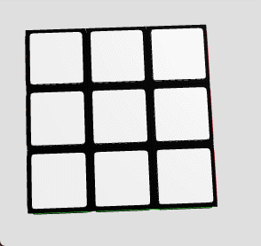
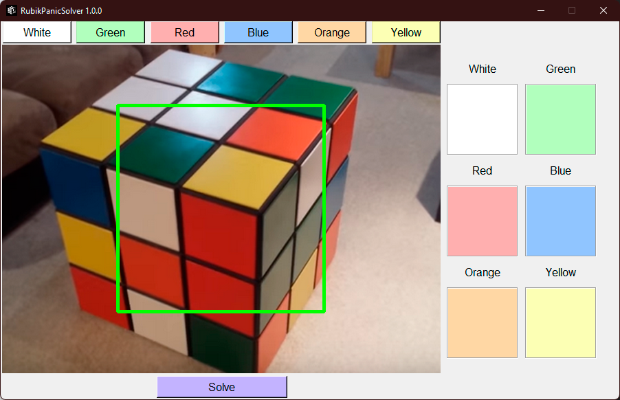

<h2 align="center">

  
Rubik Panic Solver
</h2>

Ever been on the verge of solving that Rubik's cube, only to mess up the final moves? 🤯 

Tired of twisting and turning, but getting nowhere fast in the cube conundrum? 🔄 

<div align="center">
  
</div>

> _No cubes were harmed (or solved) in the making of this gif, just a lot of spinning._

Introducing Rubik Panic Solver! 🚀 
Your go-to solution for those Rubik's cube emergencies. Now you can turn that panic into triumph! 🎉🧩

⚠️ **DISCLAIMER:** _We're not responsible for any overexcitement or sudden genius feelings post-solution._

## 📚 Table of Contents

- [How](#-how)
- [Snapshot](#snapshot-your-cube-)
- [Solve](#solve-and-be-amazed-)
- [Compile](#-compile-️)
- [Contribute](#-contribute-)
- [FAQ](#-faq-frequently-asked-questions)
- [License](#-license-)

## 📖 How

1. **Starting Up**:
   - 🚀 Launching the App:
     1. 📥 Download the latest version from the [releases page](https://github.com/zkrvf/RubikPanicSolver/releases).
     2. 📦 Unzip the downloaded `.zip` file.
     3. 🖱️ Double-click the program to execute.
     4. ⏳ The first launch might take up to 30 minutes. This is because the app needs to create essential tables, a one-time setup. This process, though time-consuming initially, ensures efficient and optimal performance in subsequent uses.

   - **Using the Python Way 🐍**:
     - 🚀 Clone the repository first:
       ```bash
       git clone https://github.com/zkrvf/RubikPanicSolver
       cd RubikPanicSolver
       ```
     - 📋 Make sure you have all the dependencies:
       ```bash
       pip install -r requirements.txt
       ```
     - 🔥 Launch the script:
       ```bash
       python RubikPanicSolver.py
       ```

<div align="center">
  
</div>

## Snapshot Your Cube 📸
2. **Taking Pictures 📷**:
   - 🧩 Position your Rubik's cube with the white face up ⬆️ and the green face towards the camera 🟢.
   - 🔍 Ensure each face of the cube is clearly visible in the webcam's view.
   - 🔄 For each face of the cube:
     1. Rotate 🌀 the cube to present a new face to the camera.
     2. Align 📏 the face you're capturing with the camera.
     3. Click 🖱️ the button corresponding to the color of the face you're capturing (e.g., click the 'White' button when capturing the white face).
   - 💡 If the snapshot doesn't seem clear or the software can't recognize the colors, try again with better lighting or adjust the light angle for clearer visibility.
   - 🎥 Follow the guidance of the on-screen gif for a visual aid on how to proceed with the snapshots.

<div align="center">
  
</div>

## Solve and Be Amazed 🧠
3. **Solution Time 🕒**:
   - 🔍 The app will analyze the snapshots and display a 2D unfolded representation of your cube. This helps you verify if the color detection was accurate.
   - 🧩 A step-by-step solution will then be generated based on the analysis.
   - 🔄 Simply follow the displayed moves on your screen to methodically solve the cube, always keeping the white face up ⬆️ and the green face front 🟢.

Happy cubing! May you never be puzzled again! 🎮🎲

## 🔧 Compile 🛠️
```bash
git clone https://github.com/your-github/RubikPanicSolver
cd RubikPanicSolver
pip install -r requirements.txt
pip install pyinstaller
pyinstaller RubikPanicSolver.spec
```
## ➕ Contribute 🤝

Got an idea to make Rubik Panic Solver even cooler? Here's how you can contribute:

1. 🍴 Fork the project.
2. 🌱 Create a new branch (git checkout -b awesome_new_feature).
3. ✍️ Make your changes and commit (git commit -am 'Add some awesomeness').
4. 🚀 Push to the branch (git push origin awesome_new_feature).
5. 📬 Submit a new Pull Request and let's review it together!

## ❓ FAQ (Frequently Asked Questions)

**Q:** Is this just a fancy way to follow a Rubik's cube algorithm?

**A:** 👀

## 📝 License 📜
The software is licensed under the [GNU General Public License v3.0](https://www.gnu.org/licenses/gpl-3.0.en.html).
